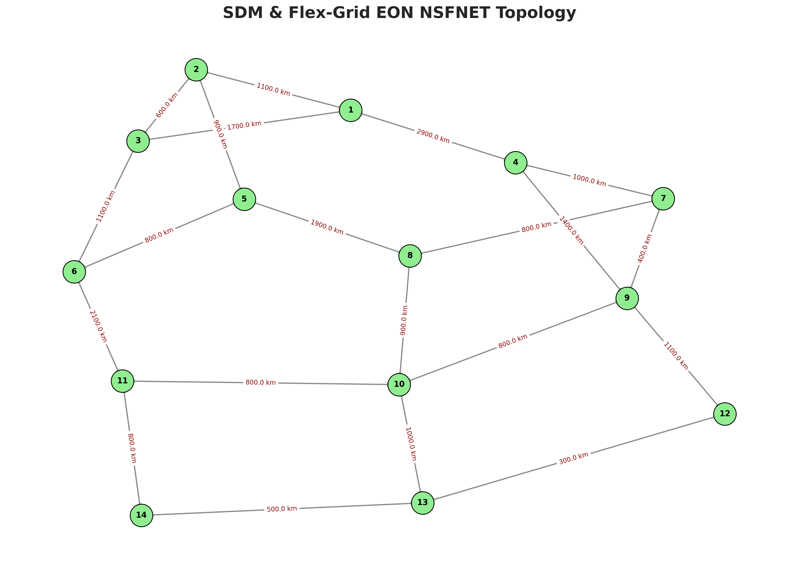
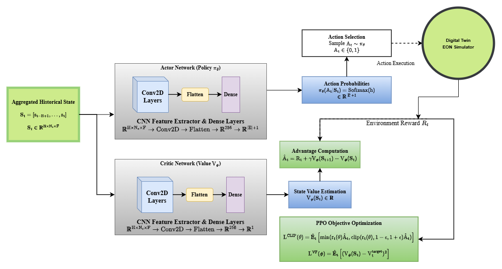
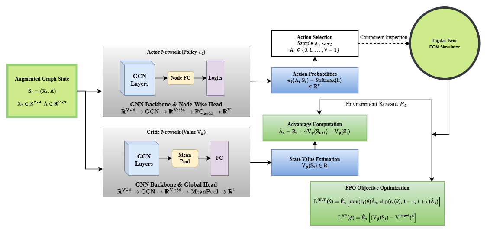
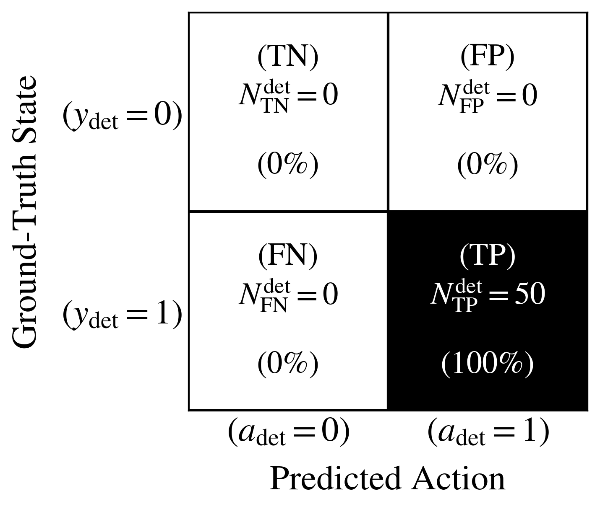
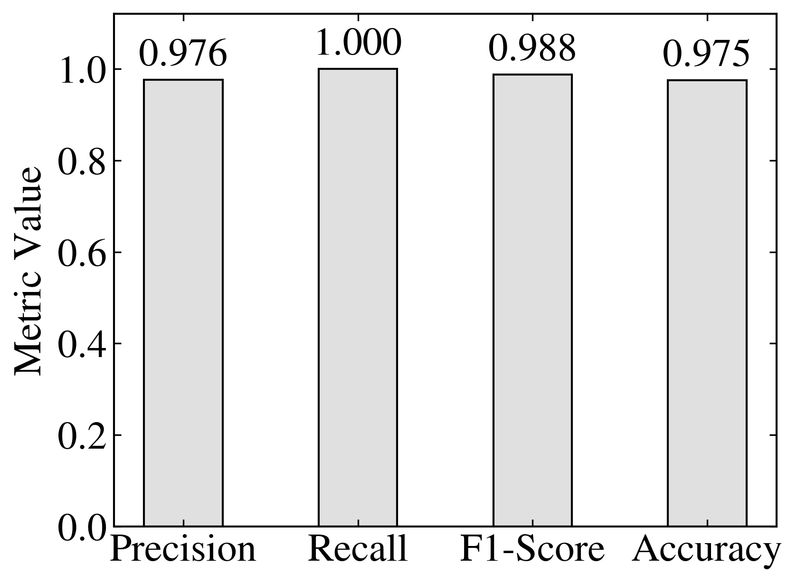

# HRL-SFDL Hierarchical Reinforcement Learning Framework

### An RL approach for soft failure detection and localization in Space Division Multiplexed Elastic Optical Networks (SDM-EONs)

**Collaborators:** 
* Raan Saurav Bhuyan (IIT-Guwahati)
* Bijoy Chand Chettarjee (South Asian University New Delhi)
* Prakash Chauhan (Cotton University Guwahati)

---

## Table of Contents
1. [EON Digital Twin v2](#eon-digital-twin-v2)
2. [Clustering Engines](#clustering-engines)
3. [Hierarchical RL Agents](#hierarchical-rl-agents)
4. [Performance Evaluation](#performance-evaluation)
5. [Interactive Web App](#interactive-web-app)

---

## EON Digital Twin v2
The EON digital twin environment version 2.0 specifications are implemented in the `eon_env/v2` module. This module simulates the complex dynamics of a Space Division Multiplexed Elastic Optical Network (SDM-EON) with realistic physical layer impairments and soft failure generation capabilities.

### Features & Implementation Details
* **Multi-Core Fiber (MCF) Support**: Simulates multi-core capabilities (e.g., 7-core SDM) including inter-core crosstalk metrics.
* **Component-Level Degradation**: Accurate modeling of localized dB loss from macrobending, EDFA pump failures, and WSS filter shifts.
* **Predictive Maintenance Sandbox**: Expands simulation duration significantly to allow modeling of gradual component degradation.
* **Flex-Grid Spectrum Allocation**: Fully models FSU resolution and high-capacity superchannels.

### Network Topology
The environment simulates the NSFNET topology with realistic geographical and node characteristics:

### Initialization Parameters
The following table highlights the default simulation parameters loaded from `eon_env/v2/constants.py`:

| Parameter | Value | Description |
| :--- | :--- | :--- |
| `FSU_RESOLUTION_GHZ` | 12.5 | Frequency Slot Unit in GHz |
| `NUM_FSUS` | 320 | Number of FSUs (approx C-band) |
| `NUM_CORES` | 7 | Space Division Multiplexing cores |
| `BAUD_RATE_GBDS` | 64.0 | Superchannel default baud rate |
| `FIBER_ATTENUATION` | 0.2 | Fiber Attenuation (dB/km) |
| `EDFA_NF` | 5.5 | EDFA Noise Figure in dB |
| `MAX_SIMULATION_DAYS` | 3650 | Max duration for predictive maintenance |
| `FAILURE_PROBABILITY_PER_DAY` | 0.5 | Soft failure injection probability |
| `SDM_MODE` | 'MCF' | Media Type (Multi-Core Fiber) |
| `MCF_COUPLING_COEFF` | 4e-4 | Coupling coefficient for IC-XT (1/m) |

---

## Clustering Engines
The framework relies on three separate clustering engines to organize and reduce the complex state space, forming the discrete tasks for the hierarchical agents.

1. **Similarity Learning Clustering**
   * *Core Functionality:* Uses metric learning and triplet loss to embed network states into a metric space where similar failures group together.
   * *Details:* [View Similarity Learning Details](clustering/similarity_learning/README.md)
2. **Locality Sensitive Hashing (LSH)**
   * *Core Functionality:* Employs rapid hash functions (SimHash) to group high-dimensional states into discrete buckets with sub-linear complexity.
   * *Details:* [View LSH Details](clustering/LSH/README.md)
3. **Contrastive Learning Clustering**
   * *Core Functionality:* Utilizes InfoNCE loss on augmented states to robustly separate distinct soft failures via a self-supervised approach.
   * *Details:* [View Contrastive Learning Details](clustering/contrastive_learning/README.md)

---

## Hierarchical RL Agents

### Soft Failure Detection (CNN_PPO)
Located in `PPO/CNN_PPO`, this actor-critic agent continuously monitors network traffic to detect anomalies and identify instances of soft failures across the SDM-EON.

* **Model Architecture**: Utilizes a Convolutional Neural Network (CNN) to process the spatial and spectral matrix representation of the network.
* **State Space**: 2D matrices representing OSNR grids, traffic demands, and spectral utilization across the MCF cores.
* **Reward Function**: High positive reward for correct anomaly detection, penalty for false positives, and severe penalty for missing critical degradations.
* **Architecture Diagram**:
  <!-- Placeholder for CNN Architecture Figure -->
  

### Soft Failure Localization (GNN_PPO)
Located in `PPO/GNN_PPO`, this agent takes over after detection to accurately pinpoint the specific network component (e.g., fiber span, EDFA, WSS) causing the failure.

* **Model Architecture**: Employs a Graph Neural Network (GNN) to explicitly model the topology of the optical network, allowing message passing between nodes to trace the origin of the impairment.
* **State Space**: Graph representations where nodes have specific equipment features (EDFA gain, WSS ports) and edges carry link metrics (fiber attenuation, distance).
* **Reward Function**: Sparse reward given upon accurately identifying the failed component index, with shaped intermediate rewards based on distance to the true failure.
* **Architecture Diagram**:
  <!-- Placeholder for GNN Architecture Figure -->
  

---

## Performance Evaluation
The framework's performance metrics are processed and generated using scripts within the `performance_plots/` directory.

* **Key Files**: 
  * `det_confusion_matrix.py` (Detection matrices)
  * `det_reward_curve.py` (Detection training stability)
  * `loc_classification_scores.py` (Localization metrics)
  * `loc_reward_curve.py` (Localization training stability)

### Soft Failure Detection Results
The confusion matrix below highlights the True Positive Rate vs False Positive Rate in identifying failure occurrences.

### Soft Failure Localization Results
The classification metrics (Precision, Recall, F1-Score) demonstrate the GNN agent's accuracy in isolating specific equipment faults across a multi-class categorization.

---

## Interactive Web App
The framework includes a fully interactive web application (located in `web_app/`) that serves as a dashboard for network operators. It allows users to:
* **Visualize Topology**: Interact with a live graph representation of the SDM-EON.
* **Control Digital Twin**: Dynamically adjust failure probabilities, degradation steps, and launch simulations.
* **Monitor RL Agents**: View real-time inferences from both the CNN_PPO detection agent and GNN_PPO localization agent as they interact with the digital twin environment.
* **Analyze Metrics**: Render performance plots and clustering visualizations on-the-fly directly in the browser.
